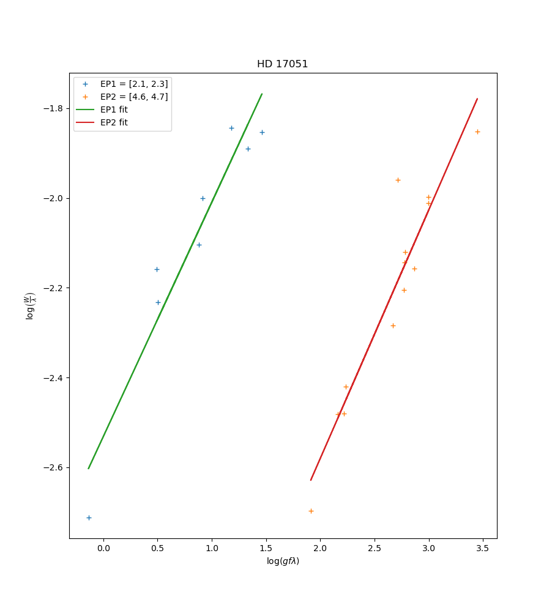
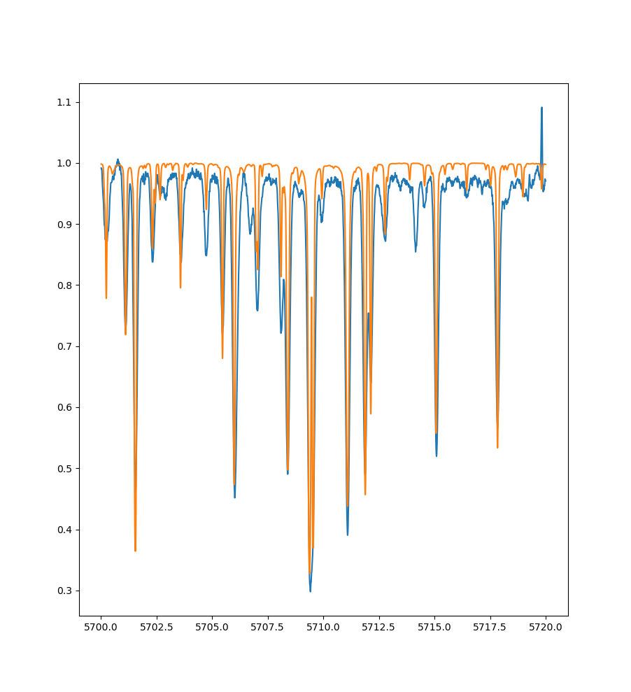

# Stellar Parameters Determination by Spectra Comparison

## Introduction

This is a simple python module designed to facilitate the comparison of spectra by equivalent width comparison. The design if purposely modular, so the user can edit and hack together exactly what they need for their use case with minimal adaptation.

### Temperature estimationg

### Spectra comparison

## Features

- IO functions to easily read and manipulate spectrum files (limit range, normalize, etc).
- Equivalent width calculation method (various methods for estimating continuum).
- Temperature estimation method from growth curves.
- Database lookup and EW comparison.
- Synthetic spectra processing (convolution methods, experimental profiles, rotational profiles).

## Structure

 Project consists of module _spectra/spectra.py_ along with examples and applications of the code in _spectra_. Everything else are databases and example spectra compatible with the code developed.

## Tips

- All functions are properly commented. Use it information on each one.
- Database files need to be properly formatted. To use the default function, files should have only 1 header line with column names to be read by _pandas_ module with correct names.

Questions and feedback are welcome!

